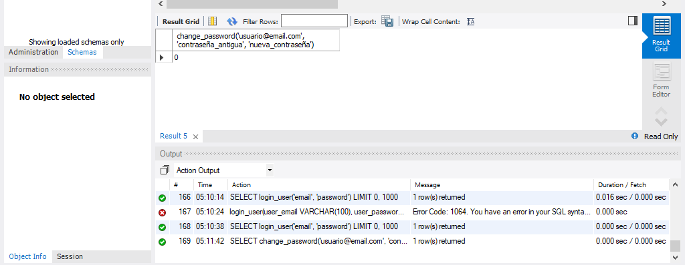
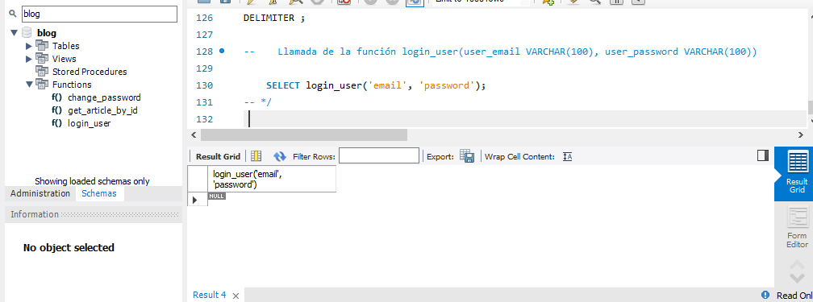
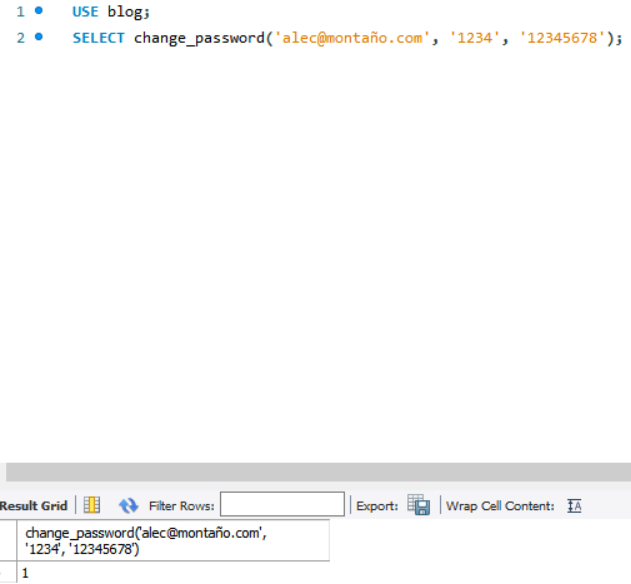
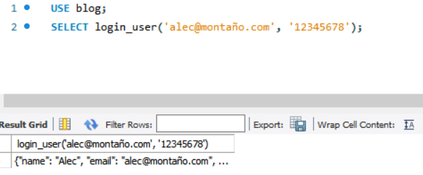

# Cuarta Entrega

# Consigna
Presentar el script de creación de 2 funciones almacenadas con base en los datos de la base de datos del proyecto final.

# Formato
El archivo a presentar debe ser del tipo .sql nombrado como “Formato + Apellido”.

# Aspectos a incluir
Puedes incluir una función que haga uso interno de funciones propias de SQL, y una segunda función que permita obtener valores de otras tablas, reemplazando a JOIN o de una subconsulta.
Procura que cada función reciba, al menos, un parámetro de entrada.
Los datos que retorne pueden ser cualquier tipo de dato.

# Correciones
La primer funcion me anda bien.

La segunda

 SELECT change_password('<usuario@email.com>', 'contraseña_antigua', 'nueva_contraseña');

Me muestra 0

La funcion Login_user me muestra null

A vos te funcionan?. Quedo atento

# Aclaraciones
La función change_password funciona correctamente, lo que pasa es que hay que probar con datos que existan en la base de datos. Por ejemplo, si ejecutamos la siguiente consulta:

SELECT change_password('alec@montaño.com', '1234', '12345678');

va a traer:

Si no, mostrará 0 como a usted le sucedió.

En la función login_user, el problema es que no se están pasando datos que existan en la base de datos. Por ejemplo, si ejecutamos la siguiente consulta:

SELECT login_user('alec@montaño.com', '12345678');

va a traer;

