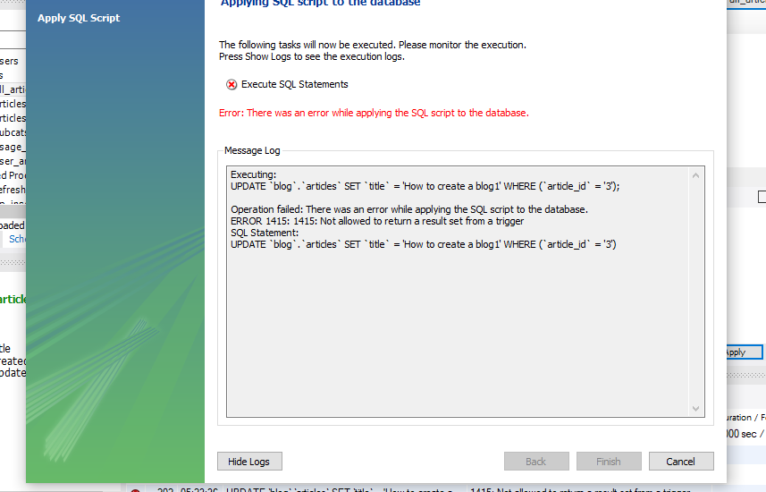

# Script de creación de triggers

Presentar en formato .sql el script de creación de 2 triggers con base en los datos de la base de datos del proyecto final

# Consigna
En la base de datos de tu proyecto final, debes incluir al menos una tabla del tipo LOG, Bitácora o Movimientos. Elegir dos de las tablas más importantes donde se operan con registros de forma frecuente, y crearás dos Triggers en cada una de ellas.

Los Triggers a crear deberán controlar la acción previo a la operación elegida (BEFORE), y una acción posterior a otra operación elegida (AFTER).

# Aspectos a incluir
- Agrega una explicación por cada trigger a crear, explicando qué controlará el mismo.
- Recuerda agregar el script de creación de las tablas LOG.
- Debe registrar el usuario que realizó la operación, la fecha, y la hora (en campos separados).

# Formato
El archivo a presentar debe ser del tipo .sql nombrado como “Triggers+Apellido”.

# Correcciones
El trigger de insercion me funciona.

Pero no te comprendi muy bien los triggers siguientes que son mar cortitos. Tambien me generan error al querer modificar por ejemplo un dato de la tabla articles

Quedo atento.

Saludos

Podes probar con USER()  si no me equivoco deberia ser ese. A que te estarias refiriendo con la aplicacion? En mi caso cuando vemos sobre triggers para el usuario. Utilizo de esa forma
# Aclaraciones
Por lo visto hay un problema al usar stored procedures en triggers. Se agregaron triggers nuevos que no usan stored procedures.